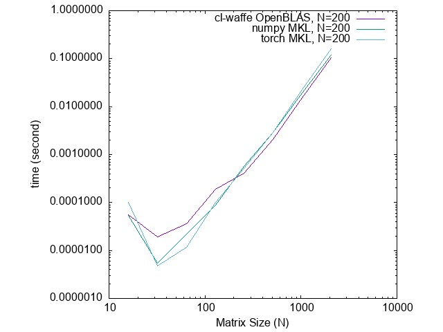
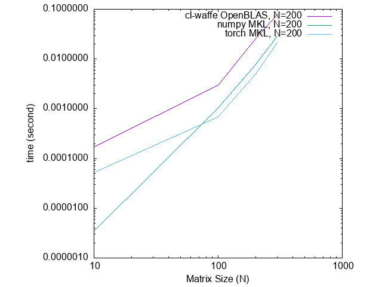
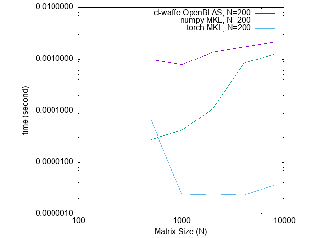
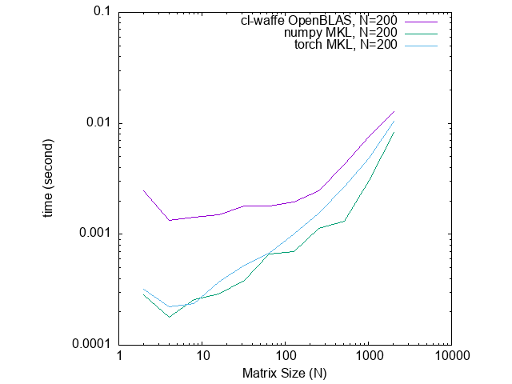

# Benchmarking

The latest benchmark is executed at 14:54:50 of Saturday, 3/25/2023 (GMT+9)

First, as a matrix arithmetic library, I measured benchmarks compared to NumPy as impartial as possible..

Also, cl-waffe is also a deep learning framework. Benchmakrs compared to PyTorch is available.

⚠️ cl-waffe and numpy are working on a different backends, openblas and mkl respectively. The author didn't know how to use numpy in OpenBLAS... So the result may be inaccuracy...

## Machine Environments

|machine-type|machine-version|software-version|software-type|
|---|---|---|---|
|X86-64|Intel(R) Core(TM) i5-7360U CPU @ 2.30GHz|21.5.0|Darwin|

## Software Environments


all benchmark is working on single-float(np.float32)

### cl-waffe

- Working on SBCL [2.1.0]
- cl-waffe (latest, 14:54:50 of Saturday, 3/25/2023 (GMT+9))

```lisp
cl-user::*lla-configuration*
(LIBRARIES (/usr/local/Cellar/openblas/0.3.21/lib/libblas.dylib))
```
### numpy

- Working on Python 3.9.12

- numpy version: 1.23.5, works on MKL

```python
import numpy as np
np.show_config()
blas_armpl_info:
  NOT AVAILABLE
blas_mkl_info:
    libraries = ['mkl_rt', 'pthread']
    library_dirs = ['/Users/hikettei/opt/anaconda3/lib']
    define_macros = [('SCIPY_MKL_H', None), ('HAVE_CBLAS', None)]
    include_dirs = ['/Users/hikettei/opt/anaconda3/include']
blas_opt_info:
    libraries = ['mkl_rt', 'pthread']
    library_dirs = ['/Users/hikettei/opt/anaconda3/lib']
    define_macros = [('SCIPY_MKL_H', None), ('HAVE_CBLAS', None)]
    include_dirs = ['/Users/hikettei/opt/anaconda3/include']
lapack_armpl_info:
  NOT AVAILABLE
lapack_mkl_info:
    libraries = ['mkl_rt', 'pthread']
    library_dirs = ['/Users/hikettei/opt/anaconda3/lib']
    define_macros = [('SCIPY_MKL_H', None), ('HAVE_CBLAS', None)]
    include_dirs = ['/Users/hikettei/opt/anaconda3/include']
lapack_opt_info:
    libraries = ['mkl_rt', 'pthread']
    library_dirs = ['/Users/hikettei/opt/anaconda3/lib']
    define_macros = [('SCIPY_MKL_H', None), ('HAVE_CBLAS', None)]
    include_dirs = ['/Users/hikettei/opt/anaconda3/include']
Supported SIMD extensions in this NumPy install:
    baseline = SSE,SSE2,SSE3
    found = SSSE3,SSE41,POPCNT,SSE42,AVX,F16C,FMA3,AVX2
    not found = AVX512F,AVX512CD,AVX512_KNL,AVX512_SKX,AVX512_CLX,AVX512_CNL,AVX512_ICL
```

# Results

## cl-waffe and numpy

### matmul

Multiplying K*K Matrices for N times.


### broadcasting

Applying broadcasting-add to A[K, K, 1] and B[1, K, K] for N times


### slice

Computes (!aref (!randn `(,K ,K)) t '(200 400)) for N times.


### DenseLayer

Computes denselayer (defined as out = `(!relu (!add (!matmul weight x) bias))`) for N times.


## cl-waffe and PyTorch

coming soon...

